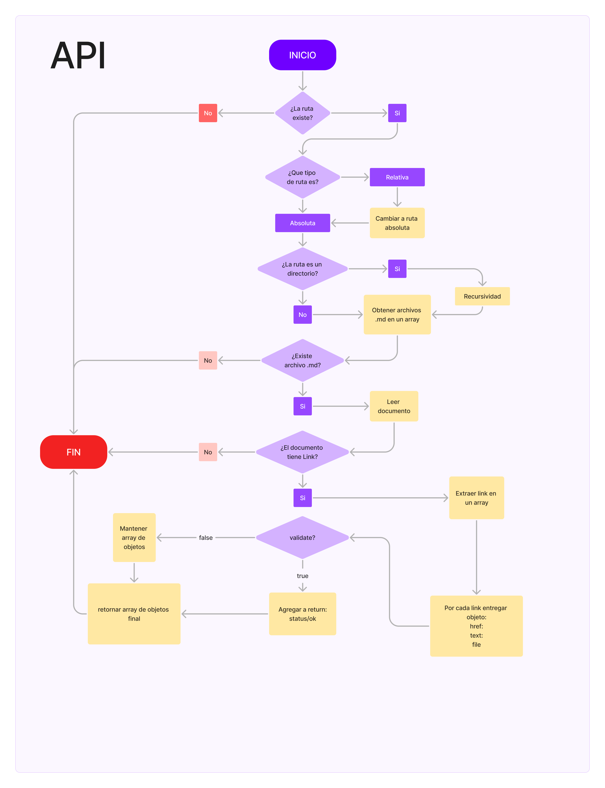
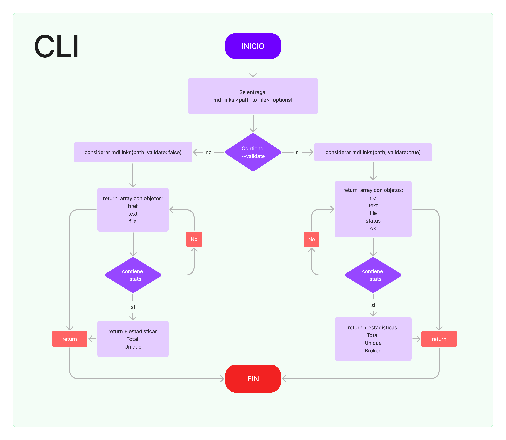
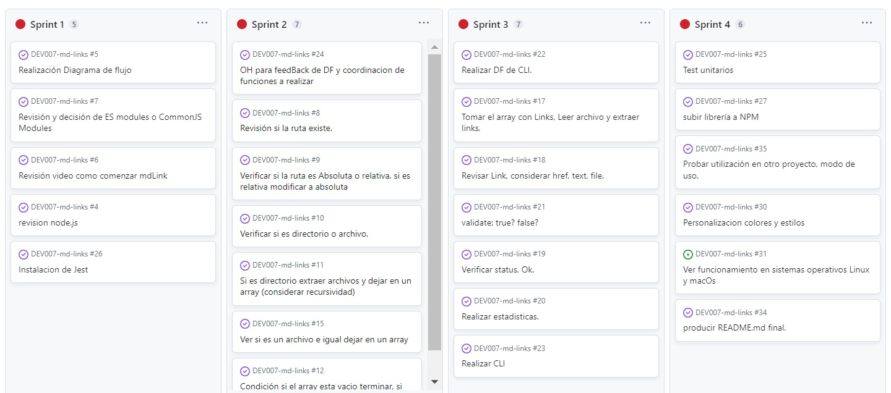

# Markdown Links

## Índice
  - [1. Documentacion técnica de la libreria](#1-documentacion-técnica-de-la-libreria)
  - [2. Diagrama de flujo](#2-diagrama-de-flujo)
  - [3. Guía de uso e instalación de la librería](#4-guía-de-uso-e-instalación-de-la-librería)
  - [4. Board](#3-board)

***
## 1. Documentacion técnica de la libreria
[Markdown](https://es.wikipedia.org/wiki/Markdown) es un lenguaje de marcado ligero muy popular entre developers. Es usado en muchísimas plataformas que manejan texto plano (GitHub, foros, blogs, ...) y es muy común encontrar varios archivos en ese formato en cualquier tipo de repositorio (empezando por el tradicional `README.md`).

Estos archivos `Markdown` normalmente contienen _links_ (vínculos/ligas) que muchas veces están rotos o ya no son válidos y eso perjudica mucho el valor de la información que se quiere compartir.

Esta herramienta de línea de comando (CLI) tiene como objetivo revisar los archivos `.md` y verificar si contienen _links_ y a su vez indicar si estos son validos o no. 

### La herramienta consta de dos partes : 

#### **1) JavaScript API**

El módulo debe poder **importarse** en otros scripts de Node.js y debe ofrecer la
siguiente interfaz:

##### `mdLinks(path, options)`

#### Argumentos

* `path`: Ruta **absoluta** o **relativa** al **archivo** o **directorio**.
Si la ruta pasada es relativa, debe resolverse como relativa al directorio
desde donde se invoca node - _current working directory_).
* `options`: Un objeto con **únicamente** la siguiente propiedad:
  - `validate`: Booleano que determina si se desea validar los links
    encontrados.

#### Valor de retorno

La función debe **retornar una promesa** (`Promise`) que **resuelva a un arreglo**
(`Array`) de objetos (`Object`), donde cada objeto representa un link y contiene
las siguientes propiedades

Con `validate:false` :

* `href`: URL encontrada.
* `text`: Texto que aparecía dentro del link (`<a>`).
* `file`: Ruta del archivo donde se encontró el link.

Con `validate:true` :

* `href`: URL encontrada.
* `text`: Texto que aparecía dentro del link (`<a>`).
* `file`: Ruta del archivo donde se encontró el link.
* `status`: Código de respuesta HTTP.
* `ok`: Mensaje `fail` en caso de fallo u `ok` en caso de éxito.

#### **2) CLI (Command Line Interface - Interfaz de Línea de Comando)**

El ejecutable de nuestra aplicación se ejecuta: 

`mdLinks <path-to-file> [options]`

#### Options

##### `--validate`

Si pasamos la opción `--validate`, el módulo debe hacer una petición HTTP para
averiguar si el link funciona o no. Si el link resulta en una redirección a una
URL que responde ok, entonces consideraremos el link como ok.

##### `--stats`

Si pasamos la opción `--stats` el output (salida) será un texto con estadísticas
básicas sobre los links considerando: 

`{Total: 3, Unique: 3}`

También podemos combinar `--stats` y `--validate` para obtener estadísticas que
necesiten de los resultados de la validación.

`{Total: 3, Unique: 3, Broken: 1}`

## 2. Diagrama de flujo

### A.- API

### B.- CLI

## 3. Guía de uso e instalación de la librería

### instalacion 

`npm i danilarat_md-links`

### Modo de Uso

El ejecutable de nuestra aplicación se realiza de siguiente manera a través de la terminal:
 `mdLinks <path-to-file> [options]`

 1.- `mdLinks`: Con este comando comienzas a utilizar la Herramienta, te muestra una pequeña descripcion de su uso. 

 2.- `path`: Argumento con el cual le indicas a la herramienta la ruta del archivo que quieres revisar, esta ruta puede ser relativa o absoluta.
     - Al agregar este argumento sin `options` igualmente entregara un resumen de los links de la ruta consultada. 

 3.- `options`: Argumento con el cual le indicas a la herramienta si deseas evaluar ciertas caracteristicas:      
  * `--validate`: el módulo debe hacer una petición HTTP para averiguar si el link funciona o no.
  * `--stats` : Si pasamos la opción --stats el output (salida) será un texto con estadísticas básicas sobre los links, el cual contendra Total de links, y total de links sin repetir. 
  * `--stats` + `--validate`: entregara estadistica completa en la cual se agregara broken que son los archivos rotos o no validos.

### Ejemplos: 

#### mdLinks 

#### mdLinks + path

#### mdLinks + path + options (una o ambas)

##### `--validate`

##### `--stats`

##### `--validate --stats`

## 4. Board
El proyecto se trabajo en 4 Sprints, en los cuales se organizo segun Diagramas de flujo establecidos. 

### [GitHub Projects](https://github.com/users/DaniLaraT/projects/3)

